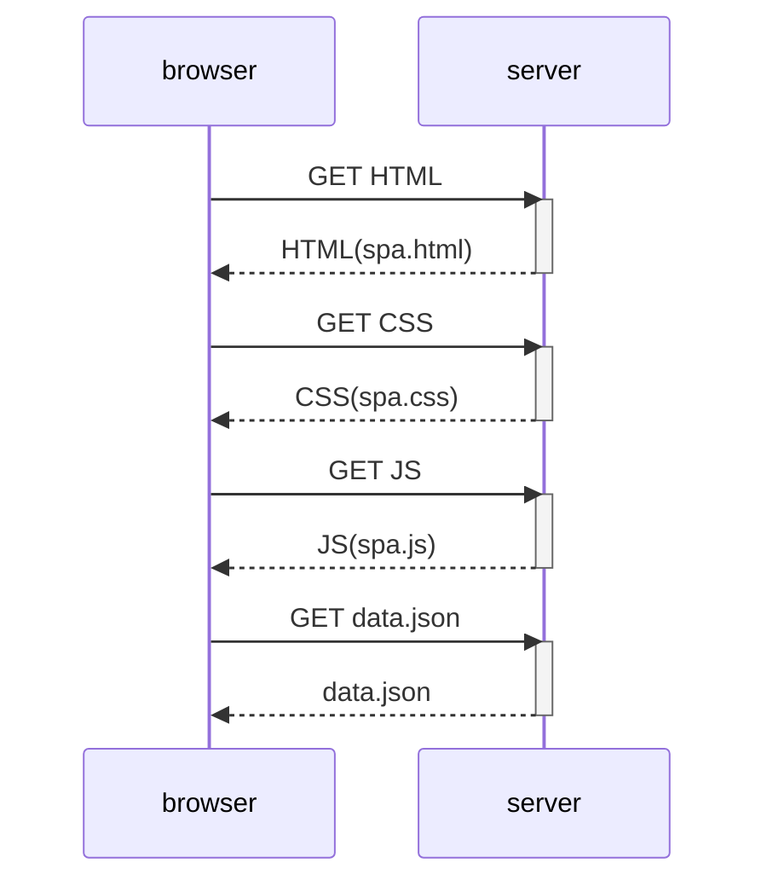

```mermaid
sequenceDiagram
participant browser
participant server

browser->>server: GET HTML
activate server
server-->>browser: HTML(spa.html)
deactivate server

browser->>server: GET CSS
activate server
server-->>browser: CSS(spa.css)
deactivate server

browser->>server: GET JS
activate server
server-->>browser: JS(spa.js)
deactivate server

browser->>server: GET data.json
activate server
server-->>browser: data.json
deactivate server


```
